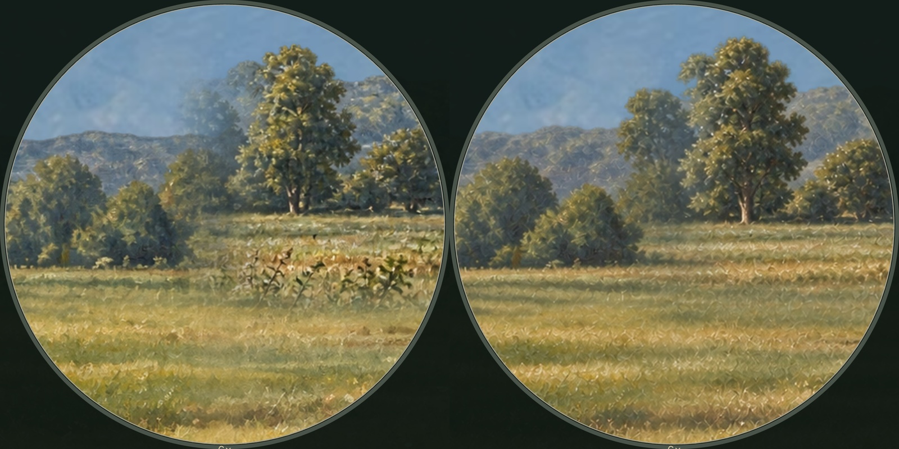

# Asset brief: Center-field vegetation repair

Status: reviewed
Date: 2026-10-03
Asset category: registered map repair
Runtime destinations: `assets/hunting/detail-v13/`, `birch-terrain-v13.webp`, `birch-detail-v13.json`
Source master: `assets/hunting/source-v13/tiles/terrain-center-repair.png`
Reference packet: `NODE_PATH=/path/to/node_modules node tools/hunting-art-reference.cjs --brief birch-base`

## Subject and role

The owner flagged the center-field scope view for its artificial-looking
vegetation. The tall hooked black and tan plants immediately below the single
central tree were oversized for their distance, and the blue woodland had an
abrupt vertical join. The selected repaint replaces the weed cluster with low
meadow grass and connects the woodland profile. Tree and shrub locations, open
animal corridor, bright daylight, light bands and the small path remain aligned.

This is a local scenery repair. It does not finish the painting conversion of
animals, Cypress, ambient wildlife or the remaining interface.

## Painting references

| Catalog ID | Priority | Specific lesson | Study region |
|---|---|---|---|
| salisbury | Primary | Connected branches, grouped foliage and deliberate small accents | Constable's left tree framing |
| veteran | Secondary | Purposeful slender stems at a consistent physical scale | Homer's lower field |
| optevoz | Inspected in rejected corrections | Quiet atmospheric land and broad tree masses | Daubigny's distant land |

The catalog schema is version 1. `prompts.json` records original source paths
and SHA-256 fingerprints. The selected second edit attaches the full Constable
and Homer originals, with the registered scene crop as its target. A cropped
Constable tree study at source rectangle [190, 520, 1510, 1820] is saved in
`inputs/constable-tree-study.jpg`; it was used only in rejected later candidates.
No buildings, people, wheat crop or other painting subjects enter the repair.

## Full production prompt and selection

Tool: built-in `image_gen.imagegen`, 2026-10-03. All four complete prompts,
transparent-alpha settings, output paths and the selected native master hash
are saved in `prompts.json`. Attempt 2 is the selected production prompt.

Attempt 1 retained the hooked weeds. Attempt 2 removed them and smoothed the
ridge step while retaining scene registration. Attempts 3 and 4 moved tree
bases and changed the surrounding meadow too much, so they were rejected.
Only attempt 2 supplies the shipped repaint. No CLI fallback, procedural
painting, sharpening or exposure filter was used.

## Export and runtime contract

The edit input is a native-density composite of the existing detail tiles over
the version 8 underpainting, sampled from the original scene rectangle
[640, 350, 450, 253]. Both the saved edit input and selected generated master
are 1672 by 941, with genuine alpha above the woodland. The rectangle is
normalized against the original 1672 by 941 terrain and stored in `layout.json`.

`tools/build-hunting-detail.cjs` defaults to version 13. It smoothly samples
the repaint into the four intersecting existing tiles: terrain-1-1, terrain-1-2,
terrain-2-1 and terrain-2-2. It removes the old paint through feathered coverage
before compositing new paint, so transparent openings can replace old opaque
shapes. It then applies the original tile-edge feather and exports 1664 by 936
WebP at quality 95, alpha quality 100 and effort 6. This code performs only
registration, resampling and compositing of saved artwork.

The other ten tiles reuse their unchanged version 9 files. The current manifest
still has 14 tiles and about 6183 by 3481 effective density; the overview is
2048 by 1152. Tile exports total 10,616,532 bytes. The manifest records original
tile masters, the repair master, input, output hashes and repaired tile IDs.
Historical version 9 exports remain independently verifiable with
`--version 9 --check`.

No extra runtime layer, mask or per-frame draw is added. The existing six-image
cache, three display buffers and 13-million-pixel limit remain in use. The sky
and hunting stand retain their version 8 assets. Raw source colors remain
visible at every clock hour. CSS and all four script queries use version 13.

## Integration review

Actual game captures use 06:47, the same 6x scope and camera center [320, 155]
in the 640 by 360 logical field. The captured Retina canvas is 2560 by 1440.
The reticle is omitted in the scenery comparison so it cannot obscure the
plant repair; the live interface retains its ordinary reticle and yardage.

Before (left), after (right), cropped and resized equally without retouching:

Native lens crops are `review/scope-before.jpg` and `scope-after.jpg`.
`wide-after.jpg` confirms the connected field and visible timber stand.
`scope-edges.jpg` shows the left, right and lower repair boundaries through
the actual lens. Reviewed against the original painting's selective foliage,
plant scale and connected tree forms. The exact flagged weed cluster is gone.
The surrounding scene retains its existing painted treatment.

The full browser run also captures dawn, noon, dusk, night, Retina, portrait,
landscape and narrow-phone views. Source-color comparisons pass at 05:30,
06:47, noon and night. Animal masks, ballistics, scope input and range remain
aligned.

## Validation

Passed: 148 Chrome browser checks, 35 WebKit range checks, eight campaign
checks, 22 physics checks, reference catalog validation, JavaScript syntax,
both version 13 and historical version 9 export fingerprints, and the native
scenery review. Temporary full captures are in `/tmp/hunting-game-v13-qa/`
and `/tmp/hunting-v13-after/`.

The post-repair Retina benchmark measured Chrome at about 120 FPS for wide,
steady scope and panning, and WebKit at about 58 to 62 FPS. These are local
2.5-second samples, with no claimed FPS improvement from the artwork change.
`docs/hunting-style/performance-v13.json` records the conditions and results.
